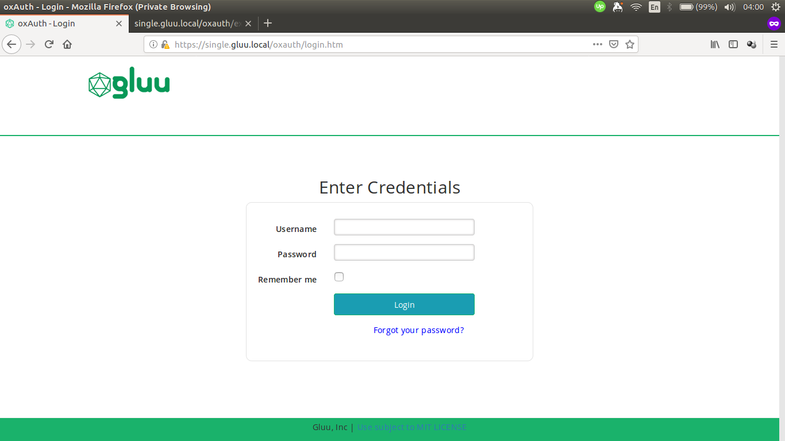

## Overview

Basic knowledge of Gluu Server [custom design](https://gluu.org/docs/ce/4.0/operation/custom-design/) is required.

Similar directories to those found in Gluu Server CE also exist in Gluu Server EE, though there is a difference in how to put these customization's inside the pod, compared to Gluu Server CE.

```text
/opt/gluu/jetty/oxauth/
|-- custom
|   |-- i18n
|   |-- libs
|   |-- pages
|   `-- static`
```

## Custom oxAuth Login Page Example Using Kubernetes ConfigMaps


This guide will show how to customize HTML pages and CSS in oxAuth for Gluu Server EE.

Here's the screenshot of the default oxAuth login page.


As an example, add text to the top of the form and change the color of the button by following these steps:

1.  Get the `login.xhtml` from oxAuth pod:

    ```sh
    kubectl cp oxauth:opt/gluu/jetty/oxauth/webapps/oxauth/login.xhtml ./login.xhtml
    ```

1.  Copy the following text and save it as `./custom.css`:

    ```css
    #loginForm .btn-primary {
        background: #1a9db2
    }
    ```

1. Create a config file to store the content of `login.xhtml` and `custom.css`.

   ```sh
   kubectl create cm oxauth-custom-html --from-file=login.xhtml
   kubectl create cm oxauth-custom-css --from-file=custom.css
   ```

1. Attach the config to Pod using YAML file:

    ```yaml
    apiVersion: v1
    kind: Pod
    metadata:
      name: oxauth
    spec:
      containers:
      - name: oxauth
        image: gluufederation/oxauth:4.0.1_06
        volumeMounts:
          - name: oxauth-pages-volume
            mountPath: /opt/gluu/jetty/oxauth/custom/pages # login.xthml will be mounted under this directory
          - name: oxauth-static-volume
            mountPath: /opt/gluu/jetty/oxauth/custom/static # custom.css will be mounted under this directory
        volumes:
          - name: oxauth-pages-volume
            configMap:
              name: oxauth-custom-html
          - name: oxauth-static-volume
            configMap:
              name: oxauth-custom-css         <div class="login_bx">
    ```

    Save the file and login to oxAuth/oxTrust UI via browser.

Here's the screenshot of customized oxAuth login page.


