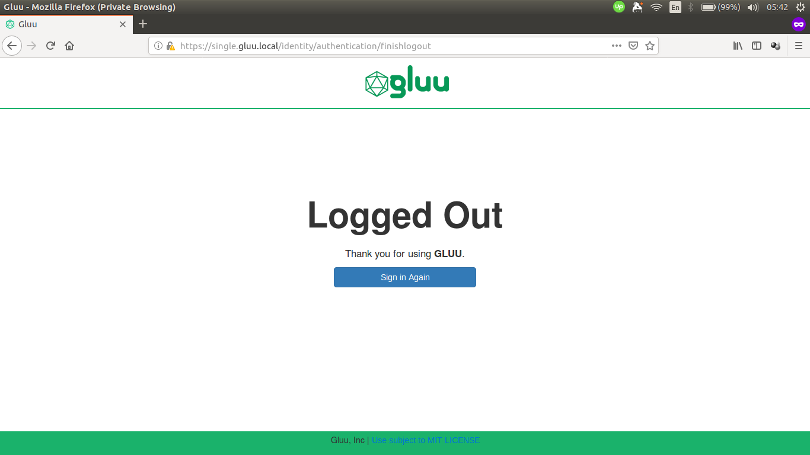

## Overview

Basic knowledge of Gluu Server [custom design](https://gluu.org/docs/ce/4.0/operation/custom-design/) is required.

Similar directories to those found in Gluu Server CE also exist in Gluu Server EE, though there is a difference in how to put these customization's inside the pod, compared to Gluu Server CE.

```text
/opt/gluu/jetty/identity/
|-- custom
|   |-- i18n
|   |-- libs
|   |-- pages
|   `-- static`
```

## Custom oxTrust Logout Page Example Using Kubernetes ConfigMaps

This guide will show examples of how to customize HTML pages and CSS in oxTrust for Gluu Server EE.

Here's the screenshot of default oxTrust logout page.



As an example, add text to the top of the form and change the color of the button by following these steps:

1.  Get the `finishlogout.xhtml` from oxTrust pod:

    ```sh
    kubectl cp oxtrust:opt/gluu/jetty/identity/webapps/identity/finishlogout.xhtml ./finishlogout.xhtml
    ```

1.  Copy the following text and save it as `volumes/oxtrust/custom/static/custom.css`:

    ```css
    .lockscreen-wrapper .btn-primary {
        background-color: #b79933 !important;
    }
    ```

1. Create a config file to store the contents of `finishlogout.xhtml` and `custom.css`.

   ```sh
   kubectl create cm oxtrust-custom-html --from-file=finishlogout.xhtml
   kubectl create cm oxtrust-custom-css --from-file=custom.css
   ```

1. Attach the config to Pod using YAML file:

	```yaml
	apiVersion: v1
	kind: Pod
	metadata:
	  name: oxtrust
	spec:
	  containers:
	  image: gluufederation/oxtrust:4.0.1_05
	  volumeMounts:
	    - name: oxtrust-pages-volume
	      mountPath: /opt/gluu/jetty/identity/custom/pages # finishlogout.xthml will be mounted under this directory
	    - name: oxtrust-static-volume
	      mountPath: /opt/gluu/jetty/identity/custom/static # custom.css will be mounted under this directory
	  volumes:
	    - name: oxtrust-pages-volume
	      configMap:
	        name: oxtrust-custom-html
	    - name: oxtrust-static-volume
	      configMap:
	        name: oxtrust-custom-css
	```

    Save the file and log in to oxAuth/oxTrust UI via browser.

Here's the screenshot of customized oxTrust logout page.

